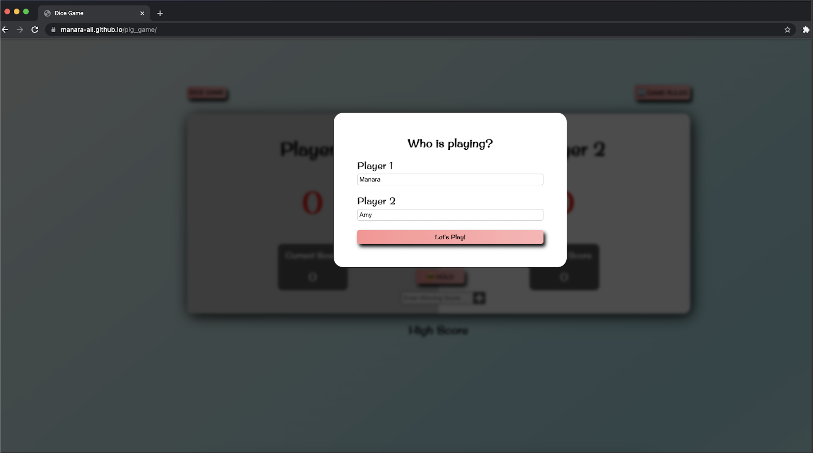

# Dice Game

This is a two players dice game that engages both players simultaneously.
Players takes turns rolling a die and the first player to reach the set final score wins the game. If a player rolls a 1 on the die he or she loses all the previously accumulated points.

## Project url
Here the link to the project https://manara-ali.github.io/pig_game/. ⚠️ Play responsibly!

## Project Image

## Warning

- This game has hidden features and unexpected edge cases that could keep setting your score back while your opponent takes the lead.

- Also, make sure to read the game rules that are displayed using the "Game Rules" button in the upper right corner.
